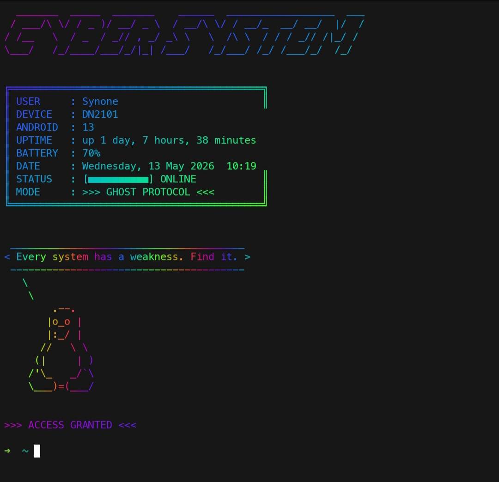

# 🌐 CyberBanner

👾 Turn your Termux into a hacker terminal. Cyberpunk banner with live system stats, random hacker quotes & RGB gradients.

## 👾 Preview

## ✨ Features

- Cyberpunk ASCII title using toilet and figlet
- Live system info (device, Android version, uptime, battery, date)
- 50+ random hacker quotes on every launch
- Rainbow color gradient via lolcat
- Tux the penguin as your welcome mascot

## 📦 Requirements

Install dependencies in Termux:

    pkg install figlet toilet lolcat cowsay termux-api -y

## ⚡ Installation

    git clone https://github.com/7xSynone/Cyberbanner.git
    cd CyberBanner
    cp banner.sh /data/data/com.termux/files/usr/etc/zshrc

If you use bash instead of zsh, copy to ~/.bashrc instead.

## 🛠️ Customization

Edit banner.sh and change:
- USER — your username
- MODE — your custom mode name
- Add or remove quotes in the quotes=() array

## 📄 License

MIT License — free to use, modify and share.

## 🖤 Author

Made with 💀 by 7 x S y (https://github.com/7xSynone)

Linux + Cybersecurity ♡ | Python & Web Dev
